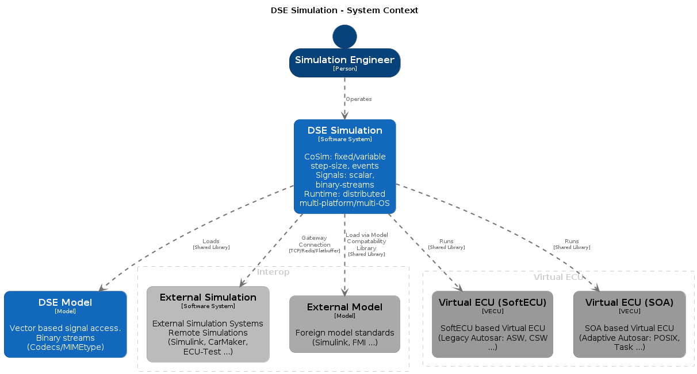
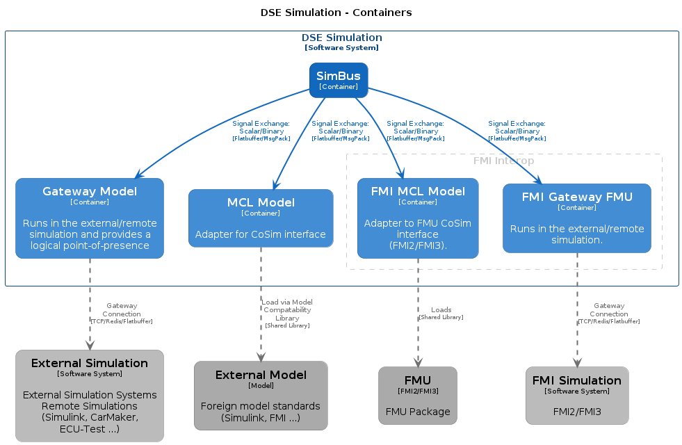
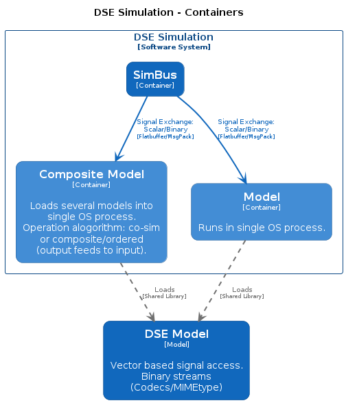
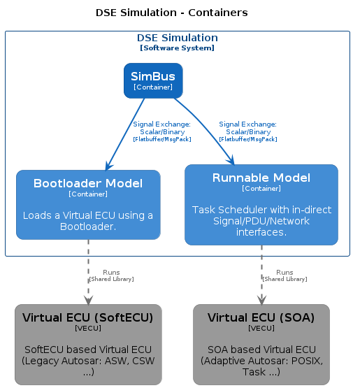
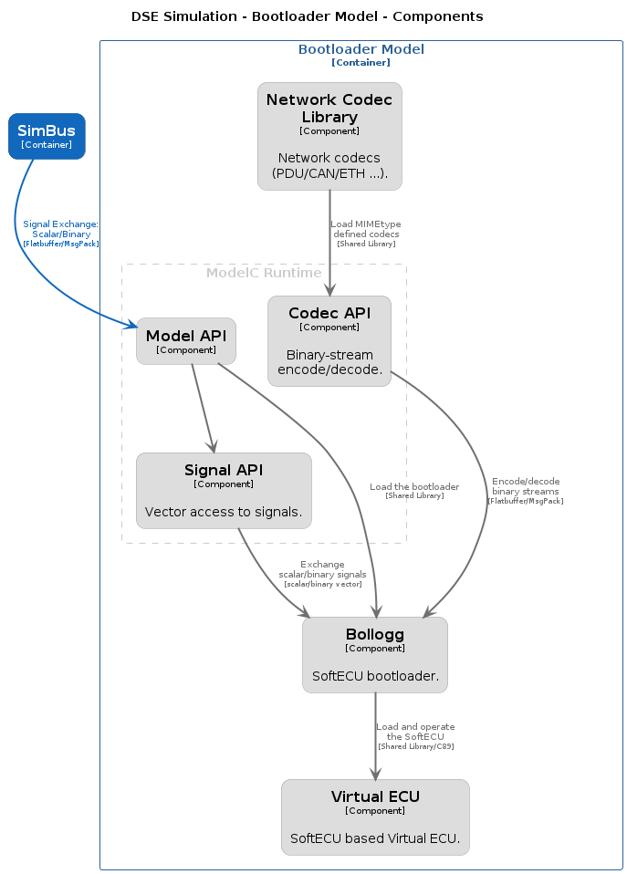
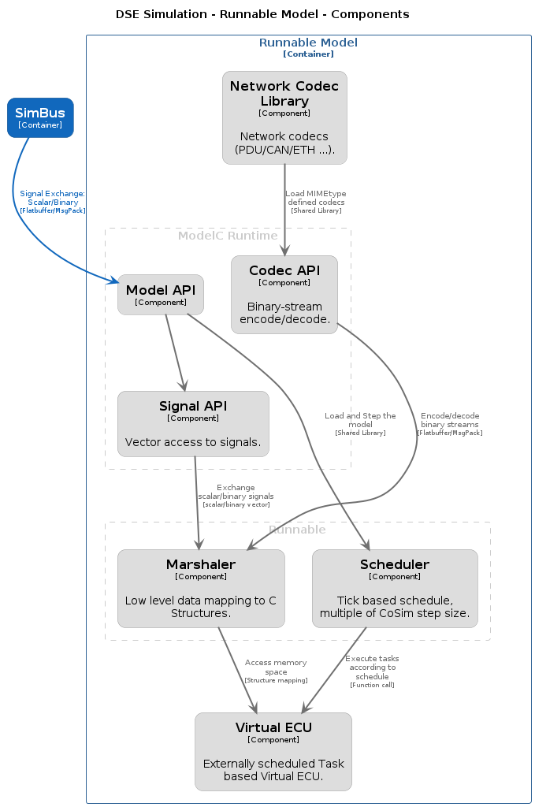
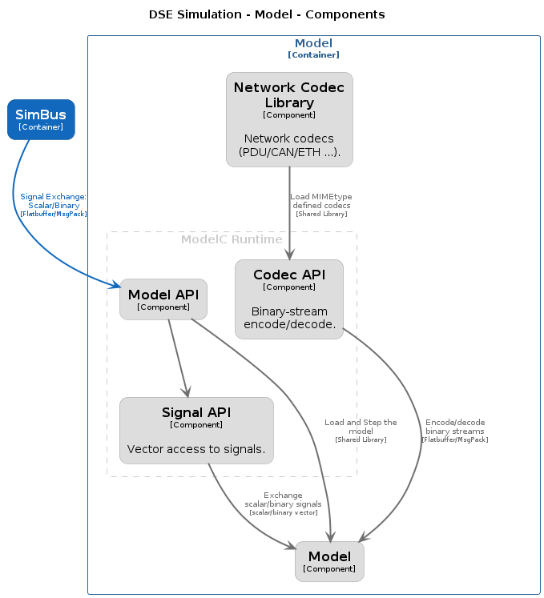
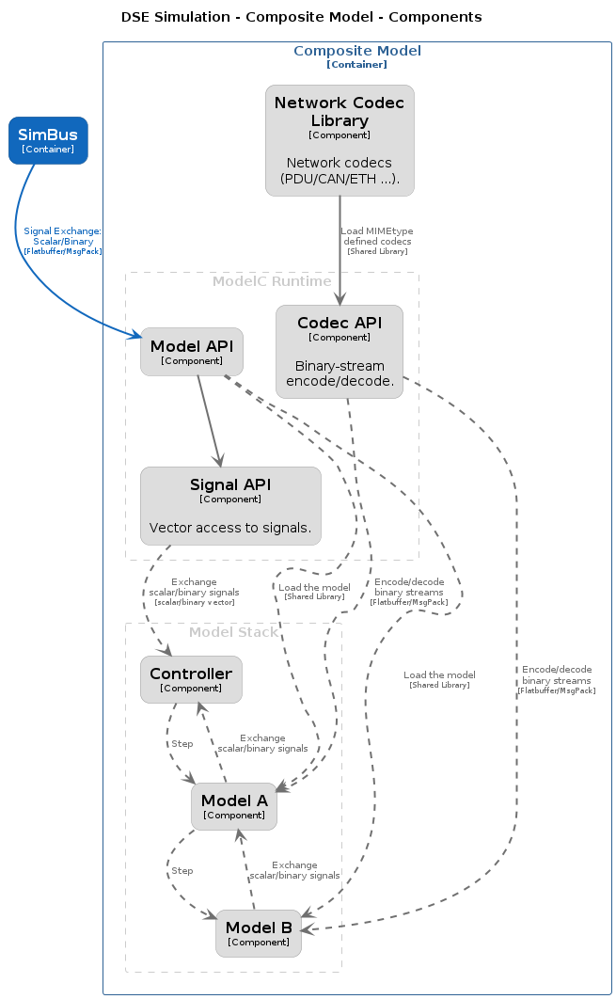
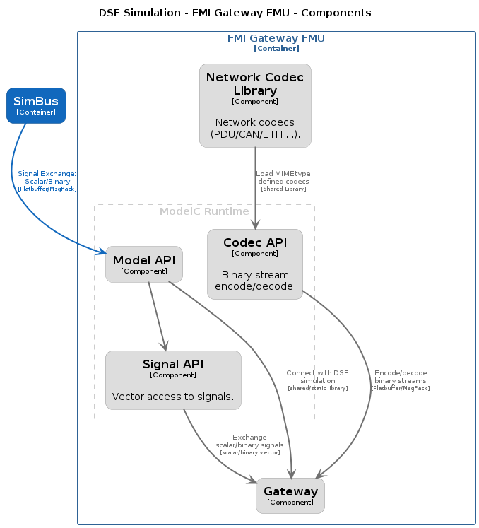
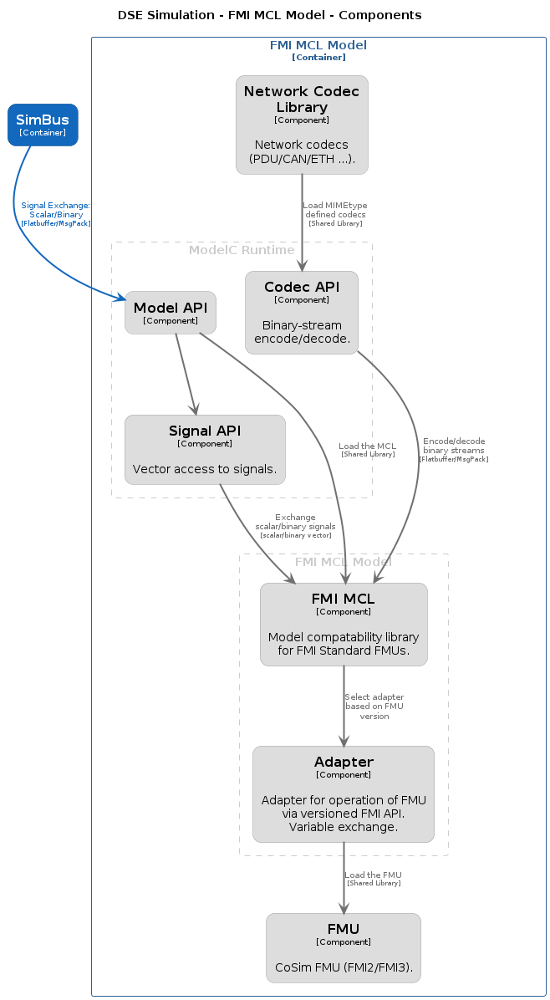

## C1 System

### System Context

## C2 Container

### Interop

### Native

### Virtual ECU

## C3 Component

### Bootloader

### Runnable

### Model

### Composite Model

### Gateway

### FMI MCL

## C4
